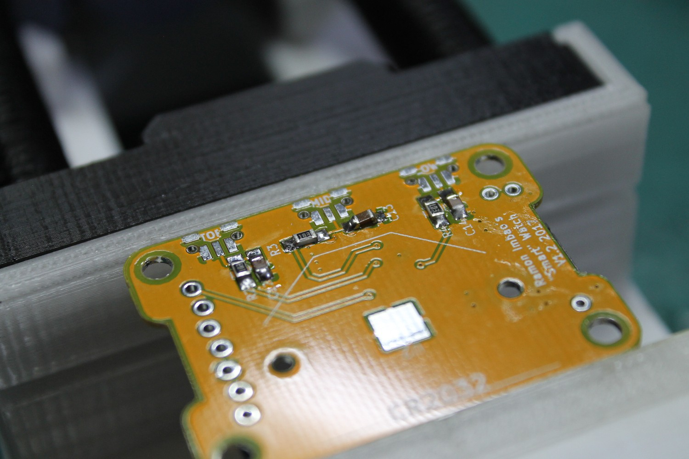

# Assembly Instructions

Below, I detail how to properly assemble the watch from bare board to finished product.

## Tools used


- Soldering iron and lead (thinner is better)
- Liquid flux (pictured above is an el cheapo flux)
- SMD tweezers
- [PCB vise](https://www.thingiverse.com/thing:2064269) (since I don't own helping hands)
- Screwdriver set
- Solder wick (not pictured)

Have the bill of materials handy to easily identify which parts go where!

## Bare board


Firstly, we'll work on the top part of the board. Specifically, the first thing I like soldering would be the FPC connector — it's the most difficult part to solder with a 0.5 mm pitch.

## FPC connector


Use plenty of flux and a solder wick to wick away any excess solder. Let's say pin 1 is the leftmost pin (though it's not). Don't worry about shorting pins 1 and 2, or pins 3, 4, 5, and 6. Those are GND and VBAT respectively. The rest of the pins must be isolated from each other however.

## Passives


Solder all the passives on the top part of the board. Just go through the bill of materials and take your time. Make sure to do a better job than I did as seen in the photo.

## Crystal


I read somewhere that you shouldn't heat up the crystal too much or you'll damage it, so take care in soldering this.

## STM32 IC


Align the IC on all the pads. Make sure that the dot on the package matches the dot on the board indicated by the silkscreen.


Here it is all soldered up. As you can see, I was very liberal with the flux.

## Passives (back)



Now you can flip the board and solder the rest of the passives at the back. All of these are just 100nF capacitors and 10kΩ resistors.

## Buttons


Place the buttons and align them using the holes on the board. It's a bit more difficult to solder these since the leads don't extend outward. A hot air station might be better suited for this.

## Solder pad


Don't forget to add a *tiny* amount of solder to the big square pad you see. This helps create a tighter fit on the battery and ensures a good connection. This should create a small bump, around 1mm thick or less.

## Battery holder


Finally, solder the battery holder on. It's the only through-hole component of the build.

## Connect ST-Link


I used a Chinese ST-Link clone. Simply connect the five relevant pins from the programmer to the board: `SWCLK`, `SWDIO`, `NRST`, `VCC`, and `GND`. There is no need to solder header pins to the board since it's staggered to ensure a tight fit.

## OpenOCD

Follow the necessary instructions for [installing OpenOCD on your system](https://gnu-mcu-eclipse.github.io/openocd/install/).

Open up a command line interface, and type in the following command to start up the OpenOCD debugger:

```
openocd -f interface/stlink-v2.cfg -f target/stm32l0.cfg
```

The output should be something like this:

```
Open On-Chip Debugger 0.10.0-dev-00399-g19df456 (2016-11-04-15:40)
Licensed under GNU GPL v2
For bug reports, read
	http://openocd.org/doc/doxygen/bugs.html
Info : auto-selecting first available session transport "hla_swd". To override use 'transport select <transport>'.
adapter speed: 300 kHz
adapter_nsrst_delay: 100
Info : The selected transport took over low-level target control. The results might differ compared to plain JTAG/SWD
none separate
Info : Unable to match requested speed 300 kHz, using 240 kHz
Info : Unable to match requested speed 300 kHz, using 240 kHz
Info : clock speed 240 kHz
Info : STLINK v2 JTAG v27 API v2 SWIM v6 VID 0x0483 PID 0x3748
Info : using stlink api v2
Info : Target voltage: 3.216787
Info : stm32l0.cpu: hardware has 4 breakpoints, 2 watchpoints
```

## Programming with SW4STM32

As my firmware files rely on [System Workbench for STM32 (SW4STM32)](http://www.st.com/en/development-tools/sw4stm32.html), a copy of that is needed to be installed.

Load up the project in SW4STM32, and flash to the board by pressing hitting Run.

## Connect the screen


Disconnect the programmer, connect a battery, and connect the screen via the 10-pin FPC connector. You should see the clock face on the display.

## Test buttons

The top and bottom buttons should move the minute hand forwards and backwards. The middle button should reset the second hand. The previous picture doesn't have a second hand, but a section of the code can be uncommented to have this appear.

## Attach screen support


It is **highly recommended** to pre-tap the holes on the screen support. You can use an M3 tap or just use a screw to create the threads.

Place the screen support on the board and partially screw in two M3×8 countersunk screws at the bottom. Take note of the orientation of the 3D printed part in relation to the screen.


The screws should stick out by around 2-3mm so you can use it to align it to the back piece.

## Back piece


Here the board and screen support is being screwed into the back piece. The threaded sections on the back piece are quite short so make sure you accidentally enlarge the hole. Tighten the screws until the top of them is flush with the screen support.


The screen should be able to sit flush on the screen support. Be careful not to bend or shatter the LCD when inserting — these things are incredibly fragile!

## Middle piece and flexible buttons


Now you can insert the middle piece through the assembly. Take note that the cutout faces the side with the buttons, and that the thinner section is nearer to the bottom.


Now place the flexible buttons inside. The buttons go flush side top.


## Fit cover and screw from back


Place the cover in front and insert the M3×12 countersunk screws from the back. This may be tight if you don't tap the threads of the screen support beforehand.


Almost complete. Yes, the screws stick out somewhat, but it's not bothersome for me.

## Attach straps


Use the M2×12 cap head screws to attach the straps to the body. There are four in total.


**Complete!** Wear it with pride. Make more for your family and friends.