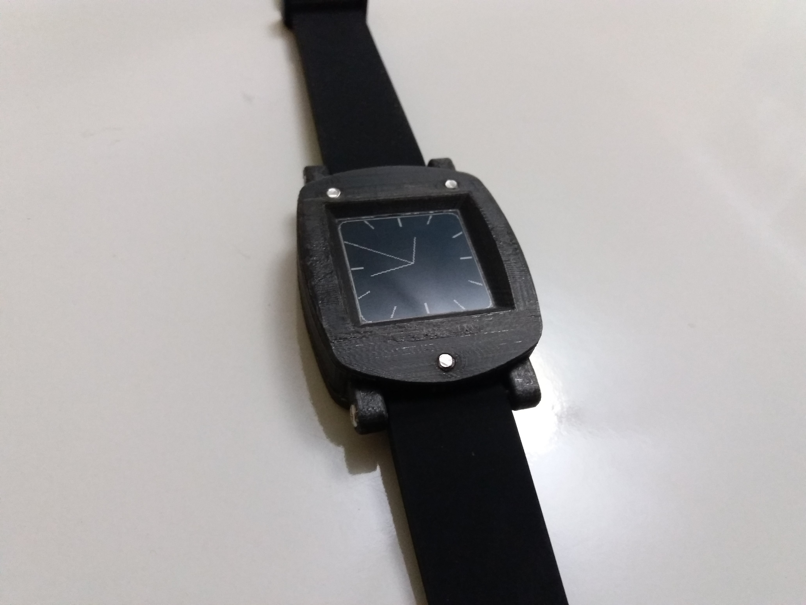

# DIY STM32-based Watch

This repository contains the necessary files for building your own STM32-based watch.

# Prerequisites

- [OpenOCD](https://gnu-mcu-eclipse.github.io/openocd/install/)
- [System Workbend for STM32](http://www.st.com/en/development-tools/sw4stm32.html)

# Assembly instructions

Details assembly instructions for the project are located in [BUILDING.md](BUILDING.md).

# License

This project is licensed under the MIT license - see the [LICENSE.md](LICENSE.md) for more details.